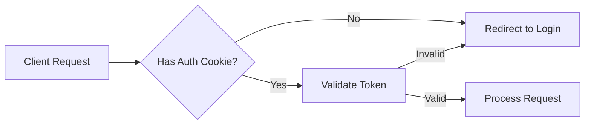

# Authentication Middleware Documentation

## Overview

The sopher.ai authentication system uses a **gradual rollout approach** to minimize disruption to existing API consumers while transitioning to mandatory authentication.

## Authentication Strategy

### Current Implementation

Authentication is **enforced at the endpoint level** rather than globally, allowing for a gradual migration:

1. **Public Endpoints** (No auth required):
   - `/healthz`, `/readyz`, `/livez` - Health checks
   - `/auth/login/google` - OAuth initiation
   - `/auth/callback/google` - OAuth callback
   - `/auth/config/status` - OAuth configuration check

2. **Protected Endpoints** (Auth required):
   - `/auth/me` - User profile
   - `/auth/logout` - Session termination
   - `/api/v1/users/me/*` - User-specific operations
   - `/api/v1/projects/*` - Book generation endpoints

### Authentication Flow



### Implementation Details

#### 1. Cookie-Based Authentication
```python
# backend/app/security.py
async def get_current_user(
    request: Request,
    token: Optional[str] = Cookie(None, alias="access_token"),
    authorization: Optional[str] = Header(None)
):
    """Extract and validate user from cookie or Bearer token."""
    # Priority: Bearer token > Cookie
    if authorization and authorization.startswith("Bearer "):
        token = authorization[7:]
    
    if not token:
        raise HTTPException(
            status_code=status.HTTP_401_UNAUTHORIZED,
            detail="Not authenticated"
        )
    
    return verify_token(token)
```

#### 2. Endpoint Protection
```python
# backend/app/routers/outline.py
@router.post("/projects/{project_id}/outline/stream")
async def generate_outline(
    project_id: str,
    current_user: TokenData = Depends(get_current_user),  # Auth required
    db: AsyncSession = Depends(get_db)
):
    """Generate outline - requires authentication."""
    # Check user budget
    if await check_user_budget_exceeded(current_user.user_id, db):
        raise HTTPException(
            status_code=status.HTTP_402_PAYMENT_REQUIRED,
            detail="Monthly budget exceeded"
        )
    # ... rest of implementation
```

## Migration Plan

### Phase 1: Soft Launch (Current)
- Authentication available but not required globally
- New endpoints require auth
- Existing endpoints continue to work

### Phase 2: Warning Period
```python
# Add deprecation headers
if not current_user:
    response.headers["X-Auth-Warning"] = "Authentication will be required starting 2025-09-01"
```

### Phase 3: Enforcement
```python
# Global middleware enforcement
@app.middleware("http")
async def auth_middleware(request: Request, call_next):
    # Skip auth for public endpoints
    public_paths = ["/health", "/auth/", "/docs"]
    if any(request.url.path.startswith(p) for p in public_paths):
        return await call_next(request)
    
    # Require auth for all other endpoints
    try:
        token = request.cookies.get("access_token")
        if not token:
            return JSONResponse(
                status_code=401,
                content={"detail": "Authentication required"}
            )
        verify_token(token)
    except Exception:
        return JSONResponse(
            status_code=401,
            content={"detail": "Invalid authentication"}
        )
    
    return await call_next(request)
```

## Security Considerations

### HttpOnly Cookies
All authentication cookies are **HttpOnly** to prevent XSS attacks:
```python
response.set_cookie(
    key="access_token",
    value=token,
    httponly=True,  # Cannot be accessed by JavaScript
    secure=True,     # HTTPS only in production
    samesite="lax"   # CSRF protection
)
```

### Frontend Integration
Since cookies are HttpOnly, the frontend automatically includes them with requests:
```javascript
// Frontend automatically sends cookies
fetch('/api/v1/projects', {
    credentials: 'include'  // Include cookies
})
```

### Token Validation
Tokens are validated on every request:
1. Check expiration (1 hour for access, 7 days for refresh)
2. Verify signature with secret key
3. Extract user claims
4. Optional: Check user still exists in database

## Rollback Plan

If issues arise, authentication can be disabled quickly:

```python
# Environment variable to disable auth
REQUIRE_AUTH = os.getenv("REQUIRE_AUTH", "true") == "true"

async def get_current_user_optional(...):
    if not REQUIRE_AUTH:
        return TokenData(user_id="anonymous", email="anonymous@sopher.ai", role="author")
    return get_current_user(...)
```

## Monitoring

Track authentication metrics:
- Failed auth attempts
- Token expiration rate
- Cookie rejection rate
- Migration progress (% authenticated requests)

## API Consumer Migration Guide

### For Browser-Based Clients
No changes needed - cookies are handled automatically.

### For API Clients
Option 1: Use Bearer tokens
```bash
curl -H "Authorization: Bearer $TOKEN" https://api.sopher.ai/api/v1/projects
```

Option 2: Use cookie authentication
```bash
curl -b "access_token=$TOKEN" https://api.sopher.ai/api/v1/projects
```

## Timeline

- **Week 1-2**: Soft launch with optional auth
- **Week 3-4**: Add deprecation warnings
- **Week 5-6**: Enable auth for 10% of requests
- **Week 7-8**: Gradual rollout to 100%
- **Week 9+**: Full enforcement

This gradual approach ensures zero downtime and gives API consumers time to adapt.